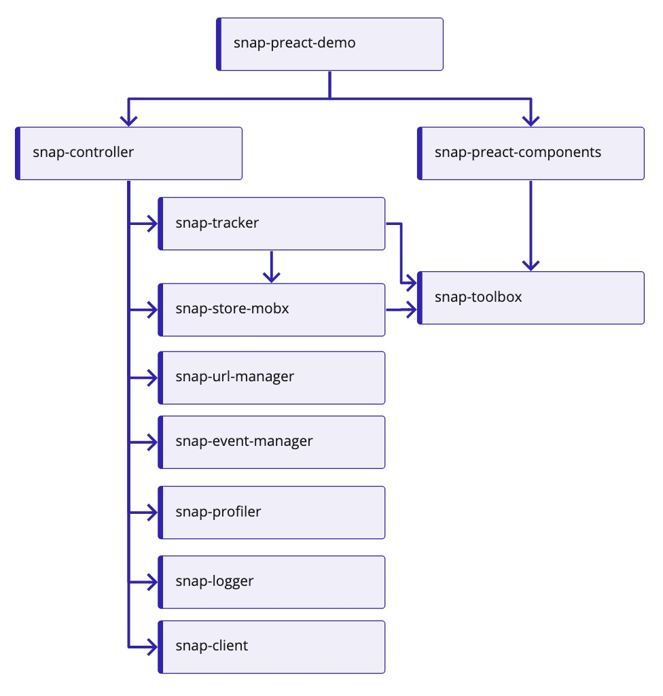

# Snap

Welcome to Snap - Searchspring's SDK for integrating into front end web apps.

---

# Contributing

We invite your participation through issues, discussions and pull requests! Please reference Searchspring's [Community Contribution Guidelines](https://github.com/searchspring/community/blob/main/CONTRIBUTING.md).

# Packages
Snap packages that are published to NPM's registry are found under the `/packages` directory. 

Documentation for each package can be found in its respective README file.

<details>
	<summary>Package dependencies hierarchy</summary>
	<br/>
	
</details>

<br>

## Client

[@searchspring/snap-client-javascript](packages/snap-client-javascript) <a href="https://www.npmjs.com/package/@searchspring/snap-client-javascript"></a>

Simple Javascript client for communicating with Searchspring's API

## Component Libraries

A collection of interface elements for front end libraries
### React / Preact

[@searchspring/snap-preact-components](packages/snap-preact-components) <a href="https://www.npmjs.com/package/@searchspring/snap-preact-components"></a>


## Controller

[@searchspring/snap-controller](packages/snap-controller) <a href="https://www.npmjs.com/package/@searchspring/snap-controller"></a>

The heart of controlling Search, Autocomplete, & Finder functionality

## Demo Stores

A demo store utilizing all Snap packages and components.
### React / Preact
Check it out at [try.searchspring.com](http://try.searchspring.com/) or use it as a reference
<!-- TODO: Update try.searchspring.com to Snap deployed demostore -->

[@searchspring/snap-preact-demo](packages/snap-preact-demo)

## Event Manager

[@searchspring/snap-event-manager](packages/snap-event-manager) <a href="https://www.npmjs.com/package/@searchspring/snap-event-manager"></a>

Hook into custom events for modifying data

## Logger

[@searchspring/snap-logger](packages/snap-logger) <a href="https://www.npmjs.com/package/@searchspring/snap-logger"></a>

Simple logger for debugging

## Profiler

[@searchspring/snap-profiler](packages/snap-profiler) <a href="https://www.npmjs.com/package/@searchspring/snap-profiler"></a>

A utility for profiling the performance of Snap features

## Store

[@searchspring/snap-store-mobx](packages/snap-store-mobx) <a href="https://www.npmjs.com/package/@searchspring/snap-store-mobx"></a>

MobX state management

## Toolbox

[@searchspring/snap-toolbox](packages/snap-toolbox) <a href="https://www.npmjs.com/package/@searchspring/snap-toolbox"></a>

A collection of utility tools such as DOM targetting, currency formatting & browser feature flags

## URL Manager

[@searchspring/snap-url-manager](packages/snap-url-manager) <a href="https://www.npmjs.com/package/@searchspring/snap-url-manager"></a>

A standard API for URL management across all Snap products

# Quick Links

[Snap API docs](https://searchspring.github.io/snapi-oas/) - Search & Autocomplete API documentation

[Snapi Explorer](https://searchspring.github.io/snapi-explorer/) - a tool for making requests to Searchspring's API.

# Prerequisite

## NPM v7.x

Npm v7.x is required for its workspaces feature

Npm v7.7.0 is optional for executing scripts in workspaces
## ~/.npmrc

Only required if packages are still private. Replace `{token}` with a Github personal access token
```text
//npm.pkg.github.com/:_authToken={token}
registry=https://registry.npmjs.org/
```

# Commands
While at the <b>repo root</b>, the following commands are available:

## Install dependencies
```shell
npm install
```

## Build
Executes `npm run build` across all packages sequentially. 
```shell
npm run build
```
## Dev
Executes `npm run dev` across all packages sequentially. All packages will be linked with hot reloading.
```shell
npm run dev
```

Demo store: http://localhost:4444

Webpack bundle analyzer: http://localhost:8888

## Commit
Instead of using `git commit`, use `npm run commit` to utilize Commitizen
```shell
npm run commit
```

## Storybook Components
Preact Components: http://localhost:6006
```shell
npm run storybook:preact
```

## Tests (unit + headless E2E)
```shell
npm run test
```

## Cypress E2E Tests
Only applies to `packages/snap-preact-demo`
```shell
npm run cypress
```

## Clean
Removes all package and root `node_modules` directories
```shell
npm run clean
```

## Execute common package.json script in all workspaces
```shell
npm run <command> --workspaces
```

## Execute package.json script within single workspace
```shell
npm run <command> [--workspace=<package> | -w <package>] [--workspace=<package> | -w <package>]
```


<h1 id="TypicalUsage">Typical Usage</h1>

This section will provide an overview of how to get up and running with Snap.

## Installation & Imports
First, we'll start by installing all Snap dependencies:

```shell
npm install --save @searchspring/snap-client-javascript @searchspring/snap-url-manager @searchspring/snap-event-manager @searchspring/snap-profiler @searchspring/snap-logger @searchspring/snap-toolbox @searchspring/snap-controller @searchspring/snap-store-mobx
```

Then we'll import them in our main entry point `index.js`:

```typescript
import SnapClient from '@searchspring/snap-client-javascript';
import { UrlManager, UrlTranslator, reactLinker } from '@searchspring/snap-url-manager';
import { EventManager } from '@searchspring/snap-event-manager';
import { Profiler } from '@searchspring/snap-profiler';
import { Logger } from '@searchspring/snap-logger';
import { DomTargeter } from '@searchspring/snap-toolbox';
import { SearchController, AutocompleteController, FinderController } from '@searchspring/snap-controller';
import { SearchStore, AutocompleteStore, FinderStore } from '@searchspring/snap-store-mobx';
```

## Snap Client
Next, let's define Snap Client as it is required and can be shared across multiple services:

```typescript
const client = new SnapClient(globals);
```

The Snap Client requires `ClientGlobals` for instantiation.

### Global Config
The `globals` object can be used to set client search parameters that will apply to all requests made with the client. Typically only the `siteId` will be set here, but could be used for setting globally utilized background filters and/or sorts as well.

If the project has been created using `@searchspring/snapfu`, the `siteId` can be referenced from the `package.json`.

```typescript
import { searchspring } from '../package.json';

const globals = {
	siteId: searchspring.siteId,
};
```

<!-- TODO: update smc link to find siteId -->
Otherwise, you can find your Searchspring `siteId` in the [Searchspring Management Console](https://manage.searchspring.net) and define it directly:

```typescript
const globals = {
	siteId: 'ga9kq2',
};
```


<h2 id="SearchTypicalUsage">Search</h2>

To set up Search using Snap, we'll need to utilize a `SearchController` which requires `SearchControllerConfig` and `ControllerServices` objects to instantiate.
```typescript
const searchController = new SearchController(searchConfig, searchControllerServices);
```
### Config (SearchControllerConfig)
Lets define a `SearchControllerConfig` object:
```typescript
const searchConfig = {
	id: 'search',
	globals: {
		filters: [],
	},
	settings: {
		redirects: {
			merchandising: true,
			singleResult: true,
		},
		facets: {
			trim: true,
		}
	},
};
```


### Category Pages / Background Filters
Optionally, apply filters from the page's content to the SearchControllerConfig `globals.filters` property. The controller globals are similar to the client globals in that all search requests will include the parameters specified. This can be used to configure category/brand pages, or other special filtering to apply to the current page's search requests.

For example, if a global variable `snapConfig` exists on the page (must be defined prior to our Snap script):

```html
<script>
	const snapConfig = {
		shopper: {
			id: 'shopper@emailprovider.com'
		},
		category: {
			name: 'Shirts',
			value: 'Clothing/Shirts'
		}
	}
</script>
```

```typescript
if (snapConfig?.category) {
	searchConfig.globals.filters.push({
		type: 'value',
		background: true,
		field: 'categories_hierarchy',
		value: snapConfig.category.value,
	});
}
```


### ControllerServices
The `ControllerServices` object contains all of the controller's dependencies.

Note that the `UrlManager` is utilizing the `UrlTranslator` which will use `'q'` as the default URL query parameter. This can be overwritten by providing a `queryParameter` config such as in this example:

```typescript
const searchControllerServices = {
	client,
	store: new SearchStore(),
	urlManager: new UrlManager(new UrlTranslator({ queryParameter: 'search_query' }), reactLinker),
	eventManager: new EventManager(),
	profiler: new Profiler(),
	logger: new Logger()
}
```

<h3 id="SearchMiddleware">Middleware</h3>

Now that our `SearchController` is defined (using `search` variable), we can optionally attach middleware to hook into various [events](/packages/snap-controller/#searchcontroller-event-lifecycle). There are two ways of doing this, using the Controller's `on` or `use` methods.
#### via `on` method:
```typescript
searchController.on('afterStore', async ({ controller }, next) => {
	controller.log.debug('store', controller.store.toJSON());
	await next();
})
```

#### via `use` method (to attach groups of middleware):
```typescript
const middleware = (controller) => {
	controller.on('init', async({ controller }, next) => {
		controller.log.imageText({
			url: 'https://searchspring.com/wp-content/themes/SearchSpring-Theme/dist/images/favicons/favicon.svg',
			text: 'snap integration initialized',
			style: `color: ${controller.log.colors.indigo}; font-weight: bold;`,
		});

		await next();
	});
	// log the store
	controller.on('afterStore', async({ controller }, next) => {
		controller.log.debug('store', controller.store.toJSON());
		await next();
	});
};


searchController.use(middleware);
```

<h3 id="SearchDomTargeter">DomTargeter</h3>

`DomTargeter` is a utility for rending components in specified DOM targets. The following example shows how to use the DomTargeter inside of the 'init' middleware of the `SearchController`.

For further usage and documentation, see [@searchspring/snap-toolbox DomTargeter](../snap-toolbox/README.md#DomTargeter)

```typescript
searchController.on('init', async ({ controller }, next) => {
	const contentTarget = new DomTargeter(
		[
			{
				selector: '#searchspring-content',
				component: <Content store={controller.store} />,
			},
		],
		(target, elem) => {
			// run search after finding target
			controller.search();

			// empty element
			while (elem.firstChild) elem.removeChild(elem.firstChild);
			render(target.component, elem);
		}
	);

	const sidebarTarget = new DomTargeter(
		[
			{
				selector: '#searchspring-sidebar',
				component: <Sidebar store={controller.store} />,
			},
		],
		(target, elem) => {
			// empty element
			while (elem.firstChild) elem.removeChild(elem.firstChild);
			render(target.component, elem);
		}
	);

	// add a listener to re-target on DOMContentLoaded
	window.addEventListener('DOMContentLoaded', () => {
		contentTarget.retarget();
		sidebarTarget.retarget();
	});

	await next();
})
```

### Initialize
Initializing the controller by invoking its `init` method will subscribe to any URL state changes and fire the `init` event and any attached middleware.

```typescript
searchController.init();
```


## Autocomplete
To set up autocomplete using Snap, we'll need to utilize an `AutocompleteController` which just like the `SearchController`, requires `AutocompleteControllerConfig` and `ControllerServices` objects to instantiate.
```typescript
const autocompleteController = new AutocompleteController(autocompleteConfig, autocompleteControllerServices);
```

### Autocomplete Config
Lets define an `AutocompleteControllerConfig` object:

```typescript
const autocompleteConfig = {
	id: 'autocomplete',
	selector: '#search_query',
	globals: {
		suggestions: {
			count: 4,
		},
		pagination: {
			pageSize: 6,
		},
	},
	settings: {
		initializeFromUrl: true,
		syncInputs: false,
		facets: {
			trim: true
		},
	},
}
```

### Autocomplete Controller Services
The `ControllerServices` object contains all of the controller's dependencies. Note the difference between SearchController's ControllerServices is the different store. Here we are using `AutocompleteStore`

Note that the `UrlManager` is utilizing the `UrlTranslator` which will use `'q'` as the URL query parameter. This can be overwritten by providing a `queryParameter` config such as in this example:

```typescript
const autocompleteControllerServices = {
	client,
	store: new AutocompleteStore(),
	urlManager: new UrlManager(new UrlTranslator({ queryParameter: 'search_query' }), reactLinker),
	eventManager: new EventManager(),
	profiler: new Profiler(),
	logger: new Logger()
}
```

The translator type should be the same between Autocomplete and Search Controllers in order for compatible URLs to be generated.

### Middleware
Autocomplete supports middleware to hook into various events. See [Search Middleware](#SearchMiddleware) above for same usage via `use` and `on` methods.


## DomTargeter
Similar to [Search DomTargeter](#SearchDomTargeter), we'll use middleware to hook into AutocompleteController's init event to render autocomplete.

For further usage and documentation, see [@searchspring/snap-toolbox DomTargeter](../snap-toolbox/README.md#DomTargeter)

```typescript
autocompleteController.on('init', async ({ controller }) => {
	new DomTargeter(
		[
			{
				selector: controller.config.selector,
				component: Autocomplete,
				inject: {
					action: 'after', // before, after, append, prepend
					element: (target, origElement) => {
						const acContainer = document.createElement('div');
						acContainer.id = 'ss-ac-target';
						acContainer.addEventListener('click', (e) => {
							e.stopPropagation();
						});
						return acContainer;
					},
				},
			},
		],
		(target, injectedElem, inputElem) => {
			// bind to config selector
			controller.bind();

			const acComponent = <target.component store={controller.store} input={inputElem} />;
			render(acComponent, injectedElem);
		}
	);
});
```

### Initialize
Initializing the controller by invoking its `init` method will subscribe to any URL state changes and fire the `init` event and any attached middleware.

```typescript
autocompleteController.init();
```


## Finder
To set up a product finder using Snap, we'll need to utilize a `FinderController` which like other controllers seen controllers, requires a `FinderControllerConfig` and a `ControllerServices` object.
```typescript
const finderController = new FinderController(finderConfig, finderControllerServices);
```

### Config (FinderControllerConfig)
There are two types of Finder configurations, a Hierarchy and Non-Hierarchy. The difference is the type of field being used and how it is configured in the Searchspring Management Console.

#### Hierarchy Config
To use a Hierarchy configuration, ensure that the config's `fields` array contain a single entry, and that the field is of type `hierarchy` in the Searchspring Management Console (SMC). Here is an example of a Hierarchy `FinderControllerConfig` object:

```typescript
const finderConfig = {
	id: 'finder',
	url: '/search'
	fields: [{
		field: 'ss_tire',
		label: 'Wheel Finder',
		levels: ['Year', 'Make', 'Model', 'Wheel Size']
	}]
}
```

#### Non-Hierarchy Config
To use a Non-Hierarchy configuration, multiple fields are specified; these fields should be `value` type facet fields (as configured in the SMC). Here is an example of a Non-Hierarchy `FinderControllerConfig` object:

```typescript
const finderConfig = {
	id: 'finder',
	url: '/search',
	fields: [
		{ 
			field: 'custom_wheel_size',
			label: 'Size'
		}, 
		{ 
			field: 'custom_wheel_width',
			label: 'Width'
		}, 
		{ 
			field: 'custom_wheel_bolt_pattern',
			label: 'Bolt Pattern'
		}, 
		{ 
			field: 'custom_color',
			label: 'Color'
		}
	]
};
```

Note: When using fields that are not of hierarchy type, `levels` are not required.

### ControllerServices
The `ControllerServices` object contains all of the controller's dependencies. Note the difference between SearchController's ControllerServices is the different store. Here we are using `FinderStore`:

```typescript
const finderControllerServices = {
	client,
	store: new FinderStore(),
	urlManager: new UrlManager(new UrlTranslator(), reactLinker),
	eventManager: new EventManager(),
	profiler: new Profiler(),
	logger: new Logger()
}
```

### Middleware
`FinderController` (like all controllers) supports middleware to hook into various events. See [Search Middleware](#SearchMiddleware) above for same usage via `use` and `on` methods.


## DomTargeter
Similar to [Search DomTargeter](#SearchDomTargeter), we'll use middleware to hook into FinderController's init event to render the `Finder` UI component (not shown).

For further usage and documentation, see [@searchspring/snap-toolbox DomTargeter](../snap-toolbox/README.md#DomTargeter)

```typescript
finderController.on('init', async ({ controller }) => {
	const finderTarget = new DomTargeter(
		[
			{
				selector: '#finder-target-selector',
				component: Finder,
			},
		],
		async (target, elem) => {
			// run search after target element is found
			await controller.search();

			const finderComponent = <target.component store={controller.store} />;
			render(finderComponent, elem);
		}
	);

	// in case the element did not exist at time of execution
	window.addEventListener('DOMContentLoaded', () => {
		finderTarget.retarget();
	});

	await next();
});
```

### Initialize
Initializing the controller by invoking its `init` method will subscribe to any URL state changes and fire the `init` event and any attached middleware.

```typescript
finderController.init();
```

### Search
After the controller has been initialized, the search method must be invoked for the finder to fetch its initial data. In the example above, this is being invoked in the DomTargeter 

```typescript
finderController.search();
```

### Find
After selection(s) have been made, the user will click on a 'Find' button. This click event should invoke the `find` method of the Finder controller which will redirect to the specified `url` in the config, along with its selection data.

```typescript
finderController.find();
```


# Troubleshooting

## Target element is not present while invoking `init`
If you attempt to initialize a snap component before the target element exists on the page, it may not be fully initialized. We recommend calling init after the DOMContentLoaded event has been invoked. 

```typescript
window.addEventListener('DOMContentLoaded', () => {
	autocomplete.init();
});

window.addEventListener('DOMContentLoaded', () => {
		searchPageTarget.retarget();
		contentTarget.retarget();
		sidebarTarget.retarget();
});
```

## Some middleware isn't executing at all
Most likely middleware that was attached prior to the one failing to execute failed to call the `await next()` function. This is required to allow other middleware to process the event data.

## Some middleware isn't executing when it should be
Most likely middleware that was attached is not using `async` functions, or failing to `await` the `next()` function.