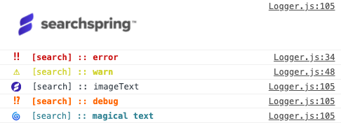
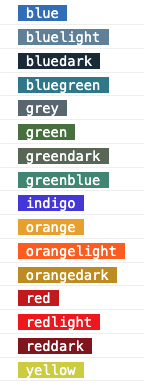

# Snap Logger

<a href="https://www.npmjs.com/package/@searchspring/snap-logger"></a>

Simple logger for debugging



---


# Dependency

Snap Logger is a dependancy of [@searchspring/snap-controller](../snap-controller) <a href="https://www.npmjs.com/package/@searchspring/snap-controller"></a>

<details>
    <summary>Package dependencies hierarchy</summary>
    <br/>
    
</details>


# Installation

```bash
npm install --save @searchspring/snap-logger
```


# Usage

## Import
```typescript
import { Logger } from '@searchspring/snap-logger';
```

## Config
Snap Logger accepts am optional string prefix

```typescript
const prefix = 'Log:';
const logger = new Logger(prefix)
```

## Controller usage
Snap Logger is a dependancy of Snap Controller and it is recommended to use logging methods of the controller

See [Typical Usage](../../README.md#TypicalUsage)

## Standalone usage
```typescript
const logger = new Logger();

logger.warn('this is a warning');
```

## `getGroup` method
Sets prefix instead of defining a prefix in constructor.
```typescript
const logger = new Logger();

logger.warn('Hello')
// 'Hello'

logger.setGroup('search')

logger.warn('Hello')
// ' [search] :: Hello'
```

## `setMode` method
Default logging mode is `production`

When set to `development`, all logging methods will be visible

When set to production, logs using `dev` will not be visible. This also includes <!-- `image`, --> `imageText`, `debug`, and `profile`


```typescript
import { Logger, LogMode } from '@searchspring/snap-logger';

const logger = new Logger();
logger.setMode(LogMode.DEVELOPMENT)
```

```typescript
enum LogMode {
	PRODUCTION = 'production',
	DEVELOPMENT = 'development',
}
```

## `error` method
```typescript
logger.error('error')
```

## `warn` method
```typescript
logger.warn('warn')
```

<!-- TODO: image doesn't work? update screenshot above to include this  -->
<!-- ## `image` method
Note: if mode is set to `LogMode.PRODUCTION`, `image` logs will not be displayed

```typescript
logger.image({ 
    url: 'https://searchspring.com/wp-content/uploads/2020/01/SearchSpring-Primary-FullColor-800-1-1-640x208.png',
    width: 10, 
    height: 10
})
``` -->

## `imageText` method
Note: if mode is set to `LogMode.PRODUCTION`, `imageText` logs will not be displayed

```typescript
logger.imageText({
    url: 'https://searchspring.com/wp-content/uploads/2020/01/SearchSpring-Primary-FullColor-800-1-1-640x208.png',
    text: `imageText`,
    style: `color: #4c3ce2; font-weight: bold;`,
});
```

## `debug` method
Note: if mode is set to `LogMode.PRODUCTION`, `debug` logs will not be displayed

```typescript
logger.debug('debug')
```

## `profile` method
Note: if mode is set to `LogMode.PRODUCTION`, `profile` logs will not be displayed

See [@searchspring/snap-profiler](../snap-profiler) <a href="https://www.npmjs.com/package/@searchspring/snap-profiler"></a>

```typescript
import { Profiler } from '@searchspring/snap-profiler';
import { Logger } from '@searchspring/snap-logger';

const logger = new Logger();
const profiler = new Profiler();

const searchProfile = profiler.create({ 
    type: 'event', 
    name: 'search', 
    context: {} 
});

searchProfile.start();

// code to profile

searchProfile.stop();

logger.profile(searchProfile)
```

## `dev` method
Note: if mode is set to `LogMode.PRODUCTION`, `dev` logs will not be displayed

```typescript
logger.dev('dev')
```


## `emojis` property
When using log emojis, the logger's `emoji` property contains various emojis

The following emojis are available:


```typescript
const emoji = {
	bang: String.fromCodePoint(0x203c),
	bright: String.fromCodePoint(0x1f506),
	check: String.fromCodePoint(0x2714),
	clock: String.fromCodePoint(0x1f556),
	cloud: String.fromCodePoint(0x2601),
	dim: String.fromCodePoint(0x1f505),
	gear: String.fromCodePoint(0x2699),
	interobang: String.fromCodePoint(0x2049),
	lightning: String.fromCodePoint(0x26a1),
	magic: String.fromCodePoint(0x2728),
	rocket: String.fromCodePoint(0x1f680),
	search: String.fromCodePoint(0x1f50d),
	snap: String.fromCodePoint(0x1f4a5),
	ufo: String.fromCodePoint(0x1f6f8),
	vortex: String.fromCodePoint(0x1f300),
	warning: String.fromCodePoint(0x26a0),
};
```

## `colors` property
When using log styles, the logger's `colors` property contains various colors

The following colors are available:



```typescript
const colors = {
	blue: '#3379c1',
	bluelight: '#688BA3',
	bluedark: '#1B3141',
	bluegreen: '#318495',

	grey: '#61717B',

	green: '#507B43',
	greendark: '#63715F',
	greenblue: '#46927D',

	indigo: '#4c3ce2',

	orange: '#ecaa15',
	orangelight: '#ff6600',
	orangedark: '#c59600',

	red: '#cc1212',
	redlight: '#f30707',
	reddark: '#8E111C',

	yellow: '#d1d432',
};
```