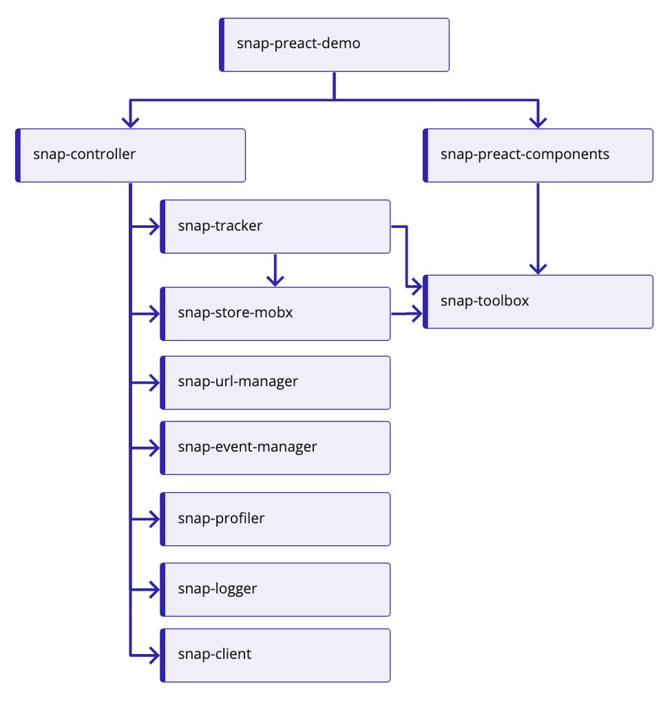

# Snap Tracker

<a href="https://www.npmjs.com/package/@searchspring/snap-tracker"></a>

The Snap Tracker service is responsible for sending beacon events. 

---

# Dependencies

Snap Tracker is a dependency of [@searchspring/snap-controller](../snap-controller) <a href="https://www.npmjs.com/package/@searchspring/snap-controller"></a>

<details>
	<summary>Package dependencies hierarchy</summary>
	<br/>
	
</details>
<br>

# Installation

```bash
npm install --save @searchspring/snap-tracker
```

# Usage
## Import
```typescript
import { Tracker } from '@searchspring/snap-tracker';
```
## Controller usage
Snap Tracker is a dependency of Snap Controller and it is recommended to use methods of the controller to invoke events to the Tracker. 

### SearchController `track` methods

#### Product Click `track.product.click`
Tracks product click events. It is reccomended to invoke on each product `onmousedown` event via the `result.track()` method - available on each `result` store object. 

```jsx
searchController.store.results.map(result)=>{(
    <a href={core.url} onMouseDown={(e)=>{result.track(e)}}>
)}
```

If invoking directly, the `intellisuggestData` and `intellisuggestSignature` values are returned from SearchSpring's Search API on each `result.attributes` object. An optional `href` value can also be provided. 

```typescript
import { SearchController } from '@searchspring/snap-controller';
import { Tracker } from '@searchspring/snap-tracker';
const searchController = new SearchController({
    ...
    tracker: new Tracker(),
    ...
}):

searchController.tracker.track.product.click({
    intellisuggestData: '37d5578e1d1646ac97701a063ba84777',
    intellisuggestSignature: '5739a2596d3b4161b041ce1764ffa04d',
    href: '/product123',
})
```

#### Product View `track.product.view`
Tracks product page views. Should be invoked from a product detail page. A `sku` and/or `childSku` are required.

```typescript
searchController.tracker.track.product.click({
    sku: 'product123',
    childSku: 'product123_a',
})
```

#### Shopper Login `track.personalization.login`
Tracks user login and sets `context.shopperId` value. Should be invoked when a user has logged into their account.

```typescript
const shopperId = "123456"
searchController.tracker.track.personalization.login(shopperId)
```

#### Cart View `track.cart.view`
Tracks cart contents. Should be invoked from a cart page. An array of cart item objects is required. Each object must contain a `qty`, `price`, (`sku` and/or `childSku`)

```typescript
searchController.tracker.track.cart.view([
    {
        sku: 'product123',
        childSku: 'product123_a',
        qty: '1',
        priice: `9.99`,
    },
    {
        sku: 'product456',
        childSku: 'product456_a',
        qty: '2',
        priice: `10.99`,
    },
])
```

#### Cart View `track.order.transaction`
Tracks order transaction. Should be invoked from an order confirmation page. Expects an object with the following:

`orderId` - (optional) order id

`total` - (optional) sub total of all items

`city` - (optional) city name

`state` - (optional) 2 digit state abbreviation (US only)

`country` - (optional) 2 digit country abbreviation	(ie. 'US', 'CA', 'MX', 'PL', 'JP')

`items` - required array of items - same object provided to `track.cart.view` event

```typescript
searchController.tracker.track.order.transaction({
    orderId: '123456',
    total: '31.97',
    city: 'Los Angeles',
    state: 'CA',
    country: 'US',
    items: [
    {
        sku: 'product123',
        childSku: 'product123_a',
        qty: '1',
        priice: `9.99`
    },
    {
        sku: 'product456',
        childSku: 'product456_a',
        qty: '2',
        priice: `10.99`
    },
]
})
```

### AutocompleteController `track` methods

#### Product Click `track.product.click`
See SearchController Product Click

#### Product View `track.product.view`
See SearchControler Product View


## Tracker

### `globals` property
When constructing an instance of `Tracker`, an optional object can be provided to its constructor. This object contains a `siteId` key and value. This is required if Tracker will be utilized in standalone usage (not used as a service of any Snap Controller)

This is not required if you will be using Snap Tracker as a service with any Snap Controller. Each controller will use the siteId provided in the Snap Client (`@searchspring/snap-client`) service instead. 

```typescript
const globals = { siteId: 'abc123' };
const tracker = new Tracker(globals);
console.log(tracker.globals === globals) // true
```

### `localStorage` property
A reference to the StorageStore object for accessing local storage

```typescript
const tracker = new Tracker();
tracker.localStorage.set('key', 'value')
tracker.localStorage.get('key') // 'value'
```

### `sessionStorage` property
A reference to the StorageStore object for accessing session storage

```typescript
const tracker = new Tracker();
tracker.sessionStorage.set('key', 'value')
tracker.sessionStorage.get('key') // 'value'
```

### `context` property
The `context` property is generated at the time of instantiating Tracker. It is passed along to the Beacon endpoint and contains the following:

`userId` - unique ID to identify the user, persisted in a cookie/local storage fallback

`pageLoadId` - unique ID generated at the time of instantiating Tracker

`sessionId` - unique ID generated at the start of a new browser session, persisted in session storage/cookie fallback

`shopperId` - unique ID provided set via the SearchController `SearchController.tracker.track.personalization.login` event and then persisted in a cookie

`website.trackingCode` - unique `siteId` found in the Searchspring Management Console (SMC). If Tracker is in standalone usage, the `siteId` is required to be provided in the `gloabls` object when instantiating Tracker. Otherwise, when used as a service with any Snap Controller, the siteId will be set by the controller. 

```typescript
context: {
    userId: '0560d7e7-148a-4b1d-b12c-924f164d3d00',
    pageLoadId: 'cfb75606-c15b-4f25-a711-9de2c5d22660',
    sessionId: 'f4b25c96-9ca1-4ac6-ad04-f5ce933f8b61',
    shopperId: 'shopper0001',
    website: {
        trackingCode: 'abc123',
    },
}
```

### `isSending` property
The `isSending` property contains the return value from `setTimeout` and when defined, signifys that an event is being sent to the beacon endpoint. If subsequent events are invoked and `isSending` is still defined, the incoming event will be added to the event queue. 

### `track` property
The `track` property contains various tracking events. If Tracker will be utilized in standalone usage, the `track` property will only contain a single function `track.shopperLogin`

```typescript
const tracker = new Tracker(),
tracker.track.shopperLogin()
```

Additional functions are added to the `track` object from various Snap Controllers.


### `init` method
The `init` method will start polling the event queue for beacon events that have yet to be sent to the beacon endpoint. Events are added to the queue if a previous event is still being sent to the beacon endpoint.

```typescript
const tracker = new Tracker();

tracker.init();
```

### `getUserId` method
Returns an object containing the `userId` stored in the `ssUserId` cookie (with a fallback to localstorage.) If key doesn't exist, a new ID will be generated, saved to cookie/localstorage, and returned. 

```typescript
const tracker = new Tracker();

console.log(tracker.getUserId()) 
// { userId: '0560d7e7-148a-4b1d-b12c-924f164d3d00' }
```

### `getSessionId` method
Returns an object containing the `sessionId` stored in the `ssSessionIdNamespace` session storage (with a fallback to cookies.) If key doesn't exist, a new ID will be generated, saved to session storage/cookie, and returned. 

```typescript
const tracker = new Tracker();

console.log(tracker.getSessionId()) 
// { sessionId: 'f4b25c96-9ca1-4ac6-ad04-f5ce933f8b61' }
```

### `getShopperId` method
Returns an object containing the `shopperId` stored in the `ssShopperId` cookie. This value is set via the SearchController `SearchController.tracker.track.personalization.login` event

```typescript
const tracker = new Tracker();

console.log(tracker.getShopperId()) 
// { shopperId: 'shopper0001' }
```

### `addEventsToQueue` method
Add multiple event payloads to existing events in the event queue. Invoked from the `sendEvents` method when a previous event is still sending. 

```typescript
const tracker = new Tracker();
const event1 = new BeaconEvent();
const event2 = new BeaconEvent();
tracker.addEventsToQueue([event1.payload, event2.payload])
```

### `getQueuedEvents` method
Returns an array of BeaconEvent payloads stored in event queue. 

```typescript
const tracker = new Tracker();

tracker.getQueuedEvents()
```

### `setBeaconEvents` method
Set multiple event payloads to event queue (overwrites any existing events in the queue.) Invoked from `sendEvents` and `clearEventQueue` methods.

```typescript
const tracker = new Tracker();
const event1 = new BeaconEvent();
const event2 = new BeaconEvent();
tracker.setBeaconEvents([event1.payload, event2.payload])
```

### `clearEventQueue` method
Clears all events from event queue. This is invoked from the `sendEvents` method when all events have successfully been sent to endpoint. Equivalent to `setBeaconEvents([])`

```typescript
const tracker = new Tracker();
tracker.clearEventQueue()
```

### `sendEvents` method
Sends BeaconEvents to endpoint. If a request is in progress and `SendEvents` is invoked again, the events will be added to the event queue instead of being sent immediately. After invoking the `init` method, the queue is polled every 10 seconds for events to be sent. `sendEvents` is invoked from the `event` and Controller `track` methods.

```typescript
const tracker = new Tracker();
const event1 = new BeaconEvent();
const event2 = new BeaconEvent();
tracker.sendEvents([event1, event2])
```


### `event` method
Given an event payload, a BeaconEvent is created and sent via the `sendEvents` method. Additionally, certain events are also sent to legacy endpoints.

```typescript
const tracker = new Tracker();
const payload = {
    type: BeaconType.CLICK,
    category: BeaconCategory.INTERACTION, 
    event: {
        intellisuggestData: '37d5578e1d1646ac97701a063ba84777',
        intellisuggestSignature: '5739a2596d3b4161b041ce1764ffa04d',
        href: '/product123'
    }
};
tracker.event(payload)
```

#### Event Payload

A beacon event payload object provided to the `event` method must contain the following:

`type` - required BeaconType enum value

`category` - required BeaconCategory enum value

`event` - object containing event data

`context.website.trackingCode` - object specifying a different siteId (required if Tracker was constructed without `globals.siteId`)

```typescript
const payload = {
    type: BeaconType.CLICK,
    category: BeaconCategory.INTERACTION,
    event: {
        intellisuggestData: '37d5578e1d1646ac97701a063ba84777',
        intellisuggestSignature: '5739a2596d3b4161b041ce1764ffa04d',
        href: '/product123',
    },
    context: {
        website: {
            trackingCode: 'abc123',
        },
    },
};

```
